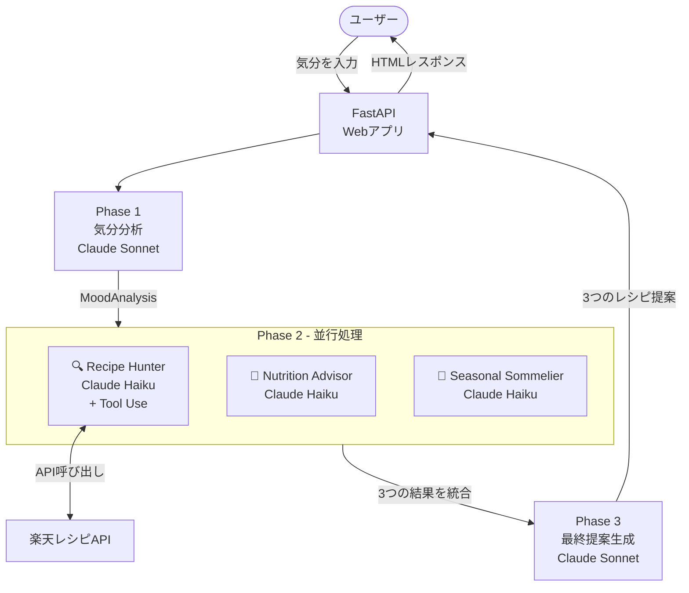

# 🍽️ MoodMeshi

**気分を入力するだけで、AIが最適な食事を3つ提案してくれるアプリ**

[](https://moodmeshi.vercel.app)
[](https://www.python.org/)
[](https://fastapi.tiangolo.com/)

🔗 **本番URL**: https://moodmeshi.vercel.app

---

## 概要

MoodMeshi は、ユーザーの気分に基づいてパーソナライズされた食事提案を行うAIアプリです。
「疲れた」「元気いっぱい」などの気分を入力すると、複数のAIエージェントが並行して処理し、**栄養・季節・楽天レシピを組み合わせた3つの提案**を返します。

---

## アーキテクチャ



---

## 処理フロー詳細

```
ユーザー入力: "疲れた"
        │
        ▼
┌──────────────────────────────────────┐
│  Phase 1: 気分分析 (Claude Sonnet)   │
│  → 気分キーワード抽出                 │
│  → 検索すべきレシピカテゴリを特定     │
└───────────────┬──────────────────────┘
                │
                ▼
┌──────────────────────────────────────┐
│  Phase 2: 並行処理 (3エージェント)    │
│                                      │
│  ┌────────────┐  ┌────────────┐      │
│  │Recipe      │  │Nutrition   │      │
│  │Hunter      │  │Advisor     │      │
│  │楽天APIで   │  │栄養素・    │      │
│  │レシピ検索  │  │食材を提案  │      │
│  └────────────┘  └────────────┘      │
│       ┌────────────┐                 │
│       │Seasonal    │                 │
│       │Sommelier   │                 │
│       │旬の食材を  │                 │
│       │推奨        │                 │
│       └────────────┘                 │
└───────────────┬──────────────────────┘
                │
                ▼
┌──────────────────────────────────────┐
│  Phase 3: 統合・最終提案 (Sonnet)    │
│  → 3つの情報を組み合わせ             │
│  → パーソナライズされた3提案を生成   │
└───────────────┬──────────────────────┘
                │
                ▼
    レシピ提案 × 3（理由・栄養・季節つき）
```

---

## 技術スタック

| カテゴリ              | 技術                              |
| --------------------- | --------------------------------- |
| **Webフレームワーク** | FastAPI + Uvicorn                 |
| **LLM**               | Anthropic Claude (Sonnet / Haiku) |
| **フロントエンド**    | Jinja2 + HTMX + CSS               |
| **HTTPクライアント**  | httpx (非同期)                    |
| **バリデーション**    | Pydantic v2                       |
| **外部API**           | 楽天レシピAPI                     |
| **デプロイ**          | Vercel (Serverless)               |
| **テスト**            | pytest + pytest-asyncio           |

### Claudeモデルの使い分け

| フェーズ                 | モデル        | 理由                                   |
| ------------------------ | ------------- | -------------------------------------- |
| Phase 1・3               | Claude Sonnet | 複雑な分析・統合に高精度なモデルを使用 |
| Phase 2 (各エージェント) | Claude Haiku  | 単純なタスクは軽量モデルでコスト最適化 |

---

## セットアップ

### 必要なもの

- Python 3.12+
- [Anthropic API Key](https://console.anthropic.com/)
- [楽天アプリID・アクセスキー](https://webservice.rakuten.co.jp/)

### ローカル起動

```bash
# リポジトリをクローン
git clone https://github.com/korezonzi/moodMeshi.git
cd moodMeshi

# 仮想環境を作成・有効化
python -m venv .venv
source .venv/bin/activate  # Windows: .venv\Scripts\activate

# 依存関係をインストール
pip install -r requirements.txt

# 環境変数を設定
cp .env.example .env
# .env を編集して各キーを設定

# 起動
uvicorn api.index:app --reload
```

ブラウザで http://localhost:8000 を開く。

### 環境変数

`.env` ファイルに以下を設定してください。

```env
ANTHROPIC_API_KEY=sk-ant-...       # Anthropic コンソールで取得
RAKUTEN_APP_ID=your_app_id         # 楽天Webサービスで取得
RAKUTEN_ACCESS_KEY=your_access_key # 同上
```

> **楽天アプリ設定の注意点**
> 楽天Webサービスのアプリ設定で「許可されたWebサイト」に `moodmeshi.vercel.app` を登録してください。
> APIスコープに **楽天レシピAPI** を含めることも必要です。

---

## ディレクトリ構成

```
moodMeshi/
├── api/
│   └── index.py              # Vercelエントリーポイント
├── app/
│   ├── agents/
│   │   ├── orchestrator.py   # 3フェーズの調整役
│   │   ├── recipe_hunter.py  # 楽天APIでレシピ検索
│   │   ├── nutrition_advisor.py # 栄養アドバイス生成
│   │   ├── seasonal_sommelier.py # 旬の食材推奨
│   │   └── types.py          # Pydanticデータモデル
│   ├── tools/
│   │   └── rakuten_recipe.py # 楽天レシピAPIクライアント
│   ├── templates/            # Jinja2 HTMLテンプレート
│   ├── static/               # CSS
│   ├── main.py               # FastAPIルート定義
│   └── config.py             # 環境変数管理
├── tests/                    # テストスイート
├── vercel.json               # Vercel設定（タイムアウト60秒）
├── requirements.txt
└── .env.example
```

---

## テスト

```bash
# 全テスト実行
pytest

# 詳細出力
pytest -v

# 特定ファイルのみ
pytest tests/test_orchestrator.py
```

---

## デプロイ (Vercel)

### 初回セットアップ

```bash
# Vercel CLIをインストール
npm i -g vercel

# プロジェクトをリンク
vercel link

# 環境変数を登録（改行なしで設定すること）
printf 'your_key' | vercel env add ANTHROPIC_API_KEY production
printf 'your_id'  | vercel env add RAKUTEN_APP_ID production
printf 'your_key' | vercel env add RAKUTEN_ACCESS_KEY production

# デプロイ
vercel deploy --prod
```

> **注意**: `echo` ではなく `printf` を使って環境変数を設定してください。
> `echo` は末尾に改行が入り、APIエラーの原因になります。

### GitHub連携（自動デプロイ）

```bash
vercel git connect
```

`master` ブランチへのプッシュで自動デプロイされます。

---

## 主要なデータの流れ

```
MoodAnalysis           RecipeHunterResult      NutritionAdvice
─────────────          ──────────────────      ───────────────
raw_input              recipes[]               mood_based_nutrients
mood_keywords          └ recipe_title          recommended_ingredients
food_keywords          └ recipe_url            avoid_ingredients
target_categories      └ recipe_material       advice_text
constraints            └ recipe_indication
                       └ recipe_cost
                                               SeasonalRecommendation
                                               ─────────────────────
                                               current_season
                                               seasonal_ingredients
                                               seasonal_dishes

                            ↓ Phase 3 で統合

                       FinalProposal
                       ─────────────
                       greeting
                       proposals[3]
                       └ rank
                       └ recipe (RakutenRecipe)
                       └ why_recommended
                       └ nutrition_point
                       └ seasonal_point
                       └ arrange_tip
                       closing_message
```
